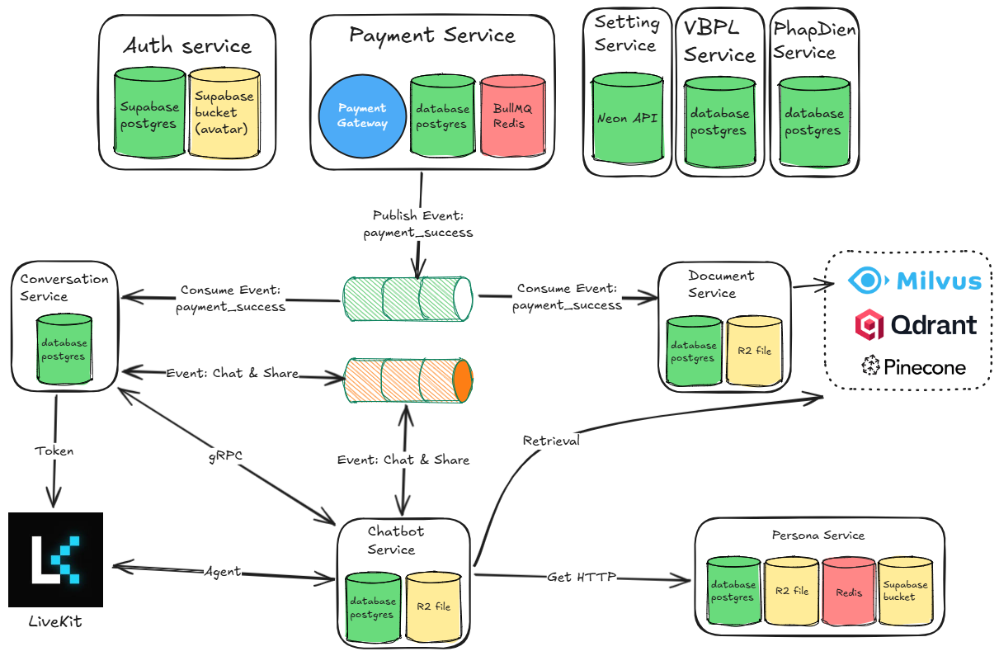
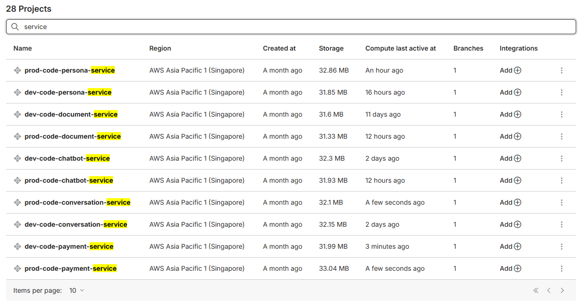
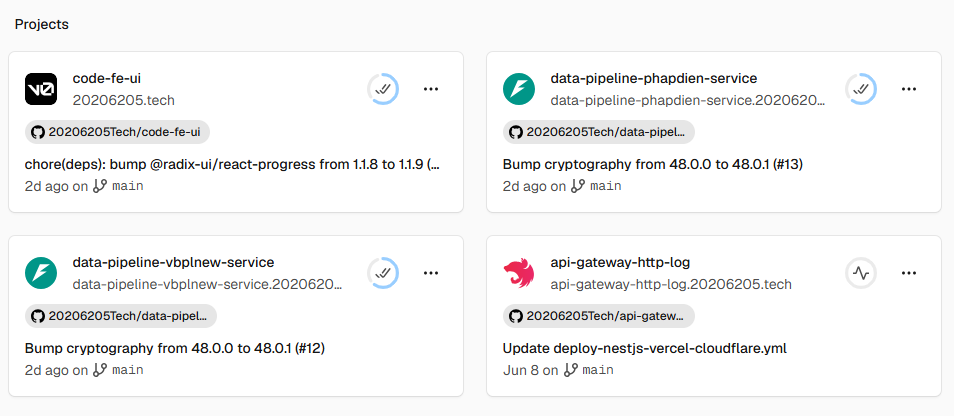
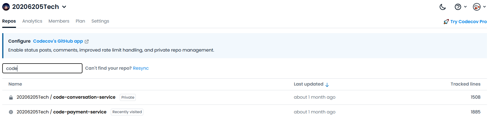
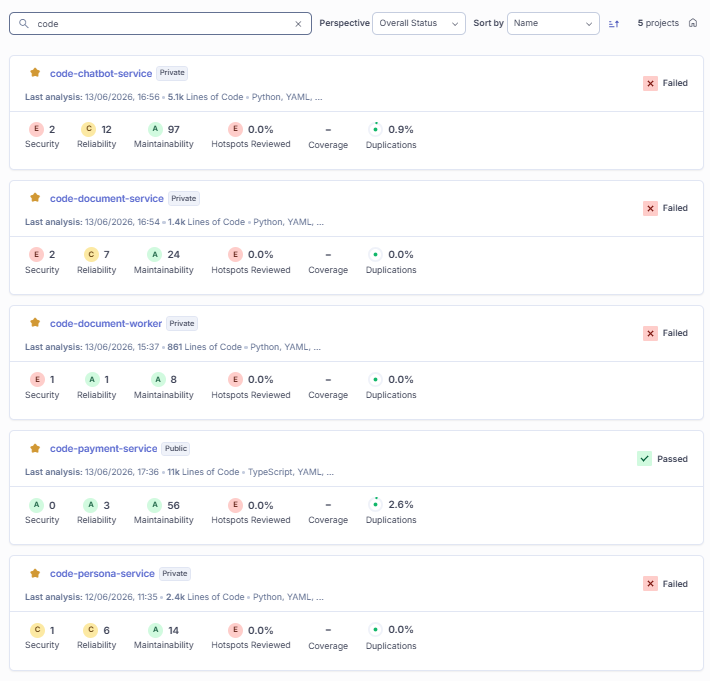
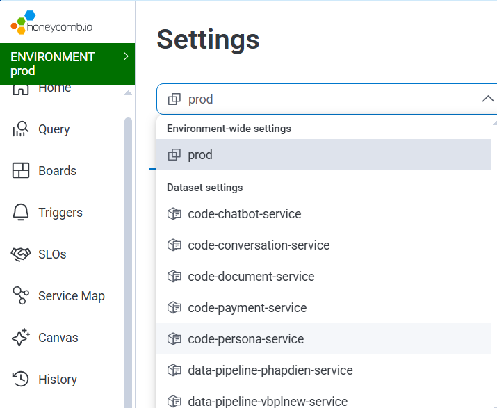

# Tổng quan các Microservice của hệ thống

Tất cả các dịch vụ đều dùng
https://[PROJECT_REF].supabase.co/auth/v1/.well-known/jwks.json
để xác thực thông tin JWT của người dùng.

Tất cả các dịch vụ
đều dùng cơ sở dữ liệu postgres của Neon
để làm cơ sở dữ liệu riêng
theo đúng mẫu cơ sở dữ liệu cho mỗi dịch vụ
(database per service pattern).
Mỗi dịch vụ sẽ sở hữu
và quản lý hoàn toàn cơ sở dữ liệu của riêng nó.

Các dịch vụ
không phải (auth và setting)
được cấu hình
trong Kong API Gateway
đơn giản chỉ tạo
Service và Route để định tuyến request.
Dịch vụ auth và setting
sẽ được mô tả chi tiết
cấu hình trong
Kong API Gateway
trong nội dung trình bày của dịch vụ.

Thống kê thông tin
đường ống dữ liệu
Data pipeline
của quản trị viên ADMIN
ít truy vấn vì vậy sẽ được
triển khai trong vercel.

Các dịch vụ NestJS
sử dụng codecov cho việc test

Tích hợp sonarqube
để phân tích chất lượng mã nguồn và bảo mật.

Tích hợp honeycomb
để tracing các dịch vụ

