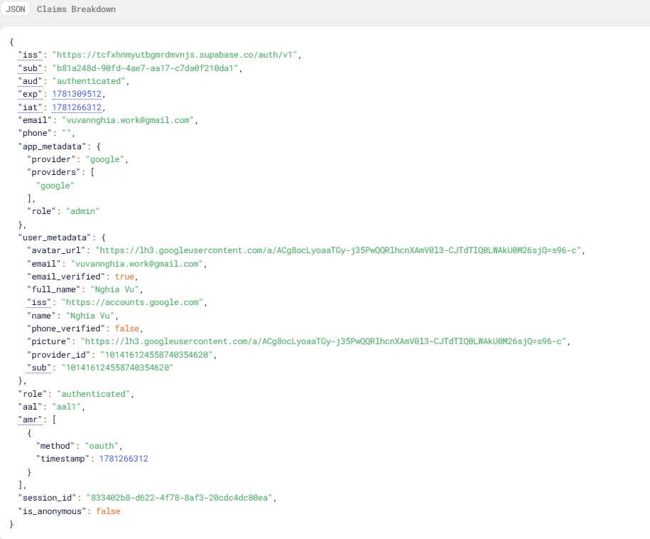
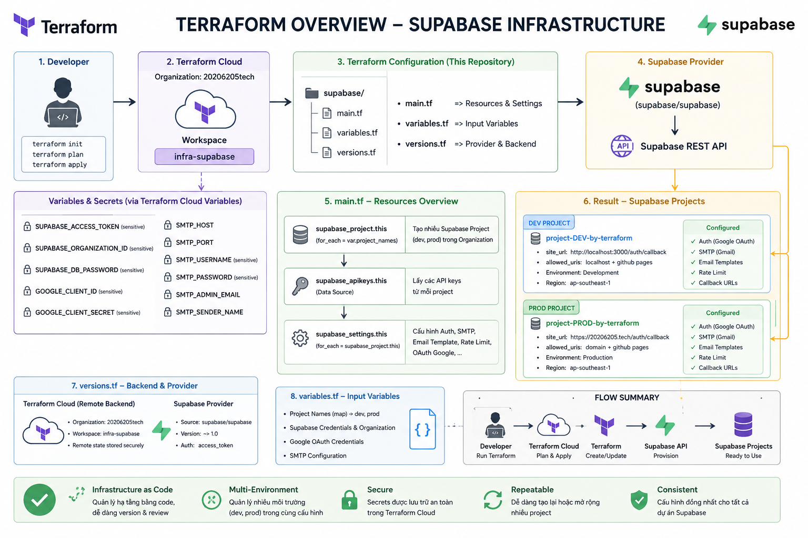
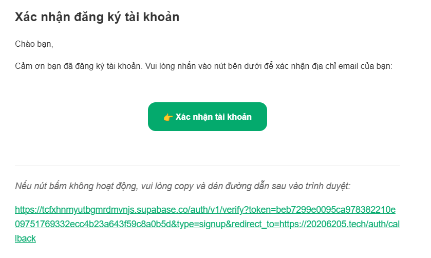
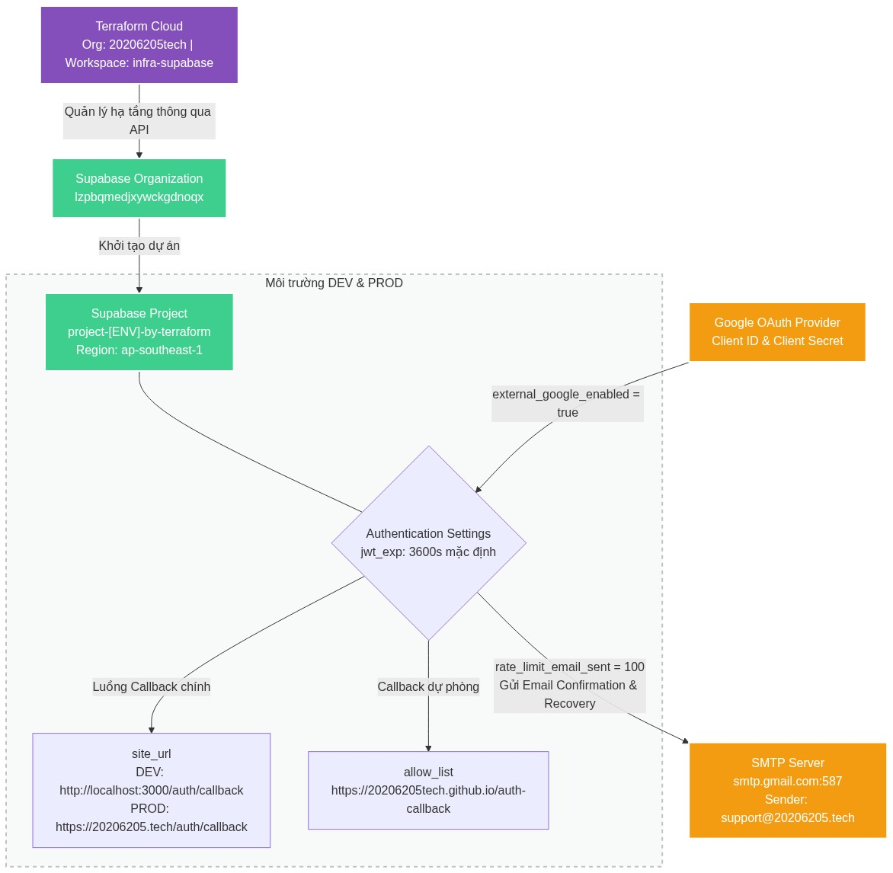
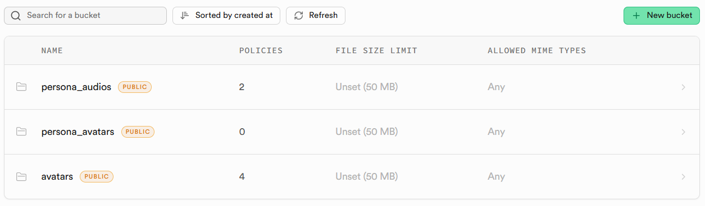
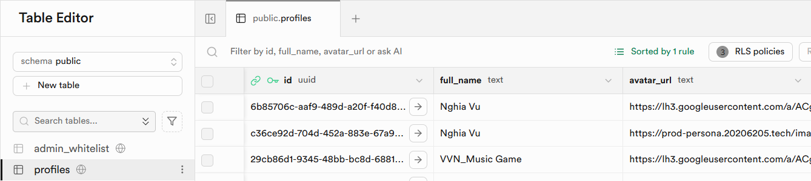
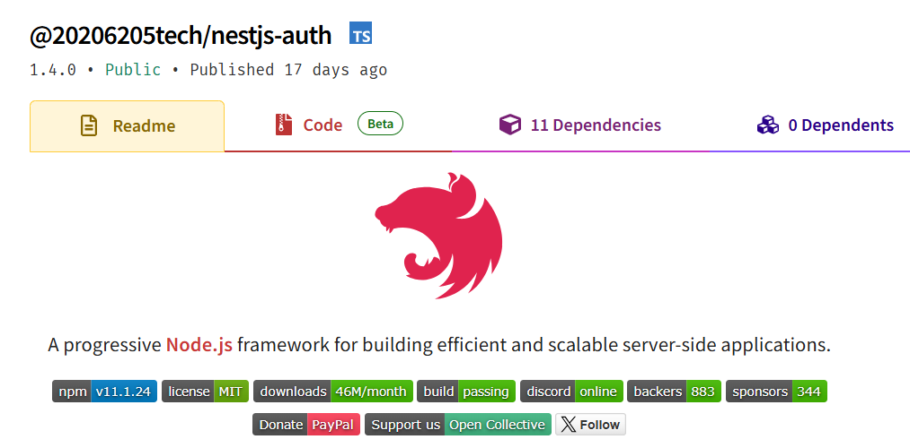

# Dịch vụ xác thực (auth service - dùng supabase)

Hệ thống sử dụng supabase
để xử lý các nhóm chức năng chính
bao gồm:
xác thực và phân quyền, xác thực 2 yếu tố, quản lý dữ liệu người dùng
và quản lý tệp tin
(lưu trữ các file ảnh đại diện do người dùng tải lên
tại
bucket avavtars).
Do mỗi lần user đăng nhập lại, Supabase/Google sẽ ghi đè lại thông tin gốc.
Do đó, bảng profiles lưu trữ thông tin người dùng cập nhật.

Mô tả chi tiết các chức năng:

## I. Xác thực & Quản lý tài khoản

Hệ thống sử dụng các API Auth của Supabase để xử lý toàn bộ luồng đăng nhập, đăng ký và bảo mật tài khoản:

xxxxxxxxxxxxxxxxx Đăng nhập bằng Google:
yyyyyyyyyyyyyyyyyyy Tạo URL và chuyển hướng người dùng đến trang ủy quyền của Google thông qua Supabase Auth Provider.
yyyyyyyyyyyyyyyyyyy Endpoint sử dụng : /auth/v1/authorize?provider=google&redirect_to={redirectUrl}

xxxxxxxxxxxxxxxxx Đăng nhập bằng Email và Mật khẩu:
yyyyyyyyyyyyyyyyyyy Cho phép người dùng đăng nhập bằng tài khoản email. Trả về thông tin Access Token và Refresh Token nếu thành công.
yyyyyyyyyyyyyyyyyyy Endpoint sử dụng : /auth/v1/token?grant_type=password

xxxxxxxxxxxxxxxxx Đăng ký tài khoản mới:
yyyyyyyyyyyyyyyyyyy Tạo tài khoản mới bằng Email và Mật khẩu, hỗ trợ gửi email xác nhận tài khoản thông qua đường dẫn chuyển hướng sau khi kích hoạt thành công ( redirect_to ).
yyyyyyyyyyyyyyyyyyy Endpoint sử dụng : /auth/v1/signup

xxxxxxxxxxxxxxxxx Khôi phục mật khẩu:
yyyyyyyyyyyyyyyyyyy Gửi yêu cầu khôi phục mật khẩu tới email của người dùng. Hệ thống sẽ gửi một email chứa liên kết để xác thực và chuyển hướng người dùng về trang đổi mật khẩu.
yyyyyyyyyyyyyyyyyyy Endpoint sử dụng : /auth/v1/recover

xxxxxxxxxxxxxxxxx Cập nhật mật khẩu mới:
yyyyyyyyyyyyyyyyyyy Cho phép người dùng đổi mật khẩu mới sau khi đã đăng nhập (hoặc sau khi click vào liên kết khôi phục mật khẩu).
yyyyyyyyyyyyyyyyyyy Endpoint sử dụng : /auth/v1/user

xxxxxxxxxxxxxxxxx Làm mới Access Token:
yyyyyyyyyyyyyyyyyyy Sử dụng refresh_token để lấy một access_token mới khi token cũ hết hạn mà không bắt người dùng phải đăng nhập lại.
yyyyyyyyyyyyyyyyyyy Endpoint sử dụng : /auth/v1/token?grant_type=refresh_token

xxxxxxxxxxxxxxxxx Đăng xuất:
yyyyyyyyyyyyyyyyyyy Hủy phiên làm việc hiện tại của người dùng trên hệ thống Supabase.
yyyyyyyyyyyyyyyyyyy Endpoint sử dụng : /auth/v1/logout

## II. Xác thực 2 yếu tố

Hệ thống hỗ trợ phương thức xác thực hai yếu tố TOTP (Time-based One-Time Password - như Google Authenticator hay Authy) bằng các API nâng cao của Supabase:

xxxxxxxxxxxxxxxxx Đăng ký thiết bị xác thực MFA mới:
yyyyyyyyyyyyyyyyyyy Khởi tạo quá trình liên kết thiết bị xác thực mới. API trả về mã QR ( qr_code ), mã bí mật ( secret ), và chuỗi URI để người dùng quét trên ứng dụng Authenticator.
yyyyyyyyyyyyyyyyyyy Endpoint sử dụng : /auth/v1/factors

xxxxxxxxxxxxxxxxx Tạo thử thách xác thực:
yyyyyyyyyyyyyyyyyyy Tạo một thử thách xác thực (challenge) dựa trên ID thiết bị MFA ( factorId ) để chuẩn bị so khớp với mã TOTP người dùng nhập.
yyyyyyyyyyyyyyyyyyy Endpoint sử dụng : /auth/v1/factors/{factorId}/challenge

xxxxxxxxxxxxxxxxx Xác thực mã TOTP:
yyyyyyyyyyyyyyyyyyy Kiểm tra mã TOTP gồm 6 chữ số người dùng nhập có khớp với thử thách hiện tại không. Nếu đúng, Supabase sẽ nâng cấp phiên đăng nhập (tăng cấp bảo mật cho Access Token).
yyyyyyyyyyyyyyyyyyy Endpoint sử dụng : /auth/v1/factors/{factorId}/verify

xxxxxxxxxxxxxxxxx Lấy danh sách các yếu tố MFA:
yyyyyyyyyyyyyyyyyyy Lấy thông tin tài khoản người dùng để lọc ra danh sách các thiết bị/yếu tố xác thực đã liên kết, phân loại thành: tất cả thiết bị ( all ) và các thiết bị đã kích hoạt thành công ( active ).
yyyyyyyyyyyyyyyyyyy Endpoint sử dụng : /auth/v1/user

xxxxxxxxxxxxxxxxx Hủy liên kết/Xóa thiết bị MFA:
yyyyyyyyyyyyyyyyyyy Xóa một thiết bị xác thực MFA khỏi tài khoản người dùng.
yyyyyyyyyyyyyyyyyyy Endpoint sử dụng : /auth/v1/factors/{factorId}

xxxxxxxxxxxxxxxxx Cập nhật tên hiển thị của thiết bị MFA:
yyyyyyyyyyyyyyyyyyy Đổi tên hiển thị ( friendly_name ) của thiết bị xác thực (ví dụ: "Điện thoại cá nhân").
yyyyyyyyyyyyyyyyyyy Endpoint sử dụng : /auth/v1/factors/{factorId}

## III. Quản lý Hồ sơ người dùng (Supabase cơ sở dữ liệu - PostgREST API)

Hệ thống sử dụng cơ chế RESTful API tự động sinh từ PostgreSQL của Supabase (PostgREST) để thực hiện các thao tác CRUD trên bảng cơ sở dữ liệu profiles :

xxxxxxxxxxxxxxxxx Lấy thông tin hồ sơ:
yyyyyyyyyyyyyyyyyyy Truy vấn thông tin chi tiết hồ sơ người dùng (như tên đầy đủ, ảnh đại diện) từ bảng profiles dựa vào userId .
yyyyyyyyyyyyyyyyyyy Endpoint sử dụng : /rest/v1/profiles?id=eq.{userId}

xxxxxxxxxxxxxxxxx Cập nhật thông tin hồ sơ:
yyyyyyyyyyyyyyyyyyy Cập nhật các trường thông tin hồ sơ như tên hiển thị ( full_name ) hoặc đường dẫn ảnh đại diện ( avatar_url ).
yyyyyyyyyyyyyyyyyyy Endpoint sử dụng : /rest/v1/profiles?id=eq.{userId}

## IV. Quản lý Ảnh đại diện (Supabase Storage)

Hệ thống sử dụng dịch vụ lưu trữ tệp (Storage) của Supabase để quản lý hình ảnh của người dùng:

xxxxxxxxxxxxxxxxx Tải lên ảnh đại diện:
yyyyyyyyyyyyyyyyyyy Tải tệp tin ảnh của người dùng lên thư mục avatars trên Supabase Storage. Tên tệp được sinh ngẫu nhiên kết hợp với userId để tránh trùng lặp.
yyyyyyyyyyyyyyyyyyy Endpoint tải lên : /storage/v1/object/avatars/{fileName}
yyyyyyyyyyyyyyyyyyy Đường dẫn công khai nhận về : /storage/v1/object/public/avatars/{fileName}

Thông tin payload của JWT từ supabase

Tham khảo tài liệu của supabase
tại
https://supabase.com/docs/guides/auth/auth-mfa/totp
Trang tài liệu này hướng dẫn cách triển khai tính năng Xác thực Đa Yếu Tố (MFA) bằng ứng dụng Authenticator (TOTP) trong Supabase.
Tính năng này hiện được cung cấp miễn phí và bật mặc định cho mọi dự án Supabase.
Nội dung chính xoay quanh hai luồng hoạt động cơ bản:

<!-- Quy trình đăng ký yếu tố bảo mật (Enrollment Flow) -->

Khởi tạo quá trình đăng ký.

Hệ thống sẽ trả về một mã QR và một chuỗi mã bí mật.

Người dùng sẽ dùng ứng dụng xác thực (như Google Authenticator) để quét mã QR này.

Chuẩn bị hệ thống để tiếp nhận mã xác minh, đồng thời trả về một challenge ID.

Đối chiếu mã 6 chữ số mà người dùng nhập vào từ ứng dụng xác thực.

Nếu mã hợp lệ, yếu tố bảo mật MFA này sẽ chính thức được kích hoạt cho tài khoản.

<!-- Quy trình kiểm tra khi đăng nhập (Challenge Flow) -->

Trích xuất danh sách các yếu tố MFA đã được người dùng đăng ký để lấy factorId.

Khi đã có factorId, ứng dụng tiếp tục gọi challenge() để mở phiên thử thách.

Dùng verify() cùng với mã OTP người dùng nhập vào để hoàn tất đăng nhập và nâng cấp phiên làm việc lên aal2.

Chi tiết về cấu hình terraform dùng để quản lý hạ tầng Supabase.

Sử dụng Terraform Cloud với workspace infra-supabase để lưu trữ và quản lý trạng thái hạ tầng một cách tập trung.

Tự động tạo các dự án cho dev và prod dựa trên project_names

Cấu hình mã vùng (region) là ap-southeast-1 tại Singapore. Đối với việc triển khai hệ thống hướng tới người dùng tại Việt Nam.

Bỏ qua sự thay đổi của mật khẩu tránh việc Terraform muốn thay đổi mật khẩu cơ sở dữ liệu mỗi lần chạy.

Tích hợp đăng nhập qua Google OAuth (Client ID và Client Secret)

Thiết lập giới hạn gửi email (rate limit)

Cấu hình Hệ thống Email (SMTP) đang để mặc định là Gmail

Ghi đè các mẫu email HTML cho "Xác nhận tài khoản" và "Đặt lại mật khẩu" để đồng nhất email thương hiệu tương tự như trong thanh toán.

Chi tiết về cấu hình di chuyển cơ sở dữ liệu supabase

Sử dụng supabase CLI tạo dự án quản lý di chuyển cơ sở dữ liệu bằng lệnh npx supabase init

Trong thư mục di chuyển cơ sở dữ liệu có các file quản lý kết hợp với Bảo mật cấp hàng RLS (Row-Level Security)

<!-- Tạo bảng admin_whitelist  lưu thông tin email admin -->

<!-- Tạo bucket avatars  lưu thông tin file ảnh đại diện người dùng -->
<!-- Tạo bảng profiles  lưu thông tin của người dùng -->

<!-- Tạo bucket persona_avatars  lưu thông tin file ảnh đại diện nhân vật -->
<!-- Tạo bucket persona_audios  lưu thông tin file  âm thanh lời chào nhân vật  -->

Kết quả bucket trên supabase

Kết quả cơ sở dữ liệu trên supabase

Để các dịch vụ khác dễ dàng phát triển, em tạo các gói thư viện dùng chung để các dịch vụ sử dụng
và dễ quản lý, dễ thay đổi

Hiện tại trong đồ án này, em có tạo 2 gói dành cho NestJS trên npm (20206205tech-nestjs-auth) và FastAPI trong python (20206205tech-python-auth) với các bước kiểm tra:

<!-- Kiểm tra về  Request-Id  từ Kong API Gateway  -->
<!-- Kiểm tra về  Request-Kong-Secret  từ Kong API Gateway  -->
<!-- Kiểm tra về  chữ ký JWT  của người dùng với supabase -->
<!-- Kiểm tra về  MFA  (yêu cầu bắt buộc) đảm bảo bảo mật dữ liệu   -->
<!-- Kiểm tra về  vai trò người dùng với những API bảo vệ với vai trò quản trị viên ADMIN   -->

## Cấu hình trong Kong API Gateway

Tạo services trỏ về URL của dự án Supabase (https://[PROJECT_REF].supabase.co)

Thiết lập Route: Tạo một Route liên kết với Service vừa tạo. Tham số strip_path=true đảm bảo Kong sẽ xóa tiền tố khỏi URI trước khi chuyển tiếp request đến Supabase.

Dùng plugin request-transformer để tự động thêm apikey vào header trước khi gửi đến Supabase
