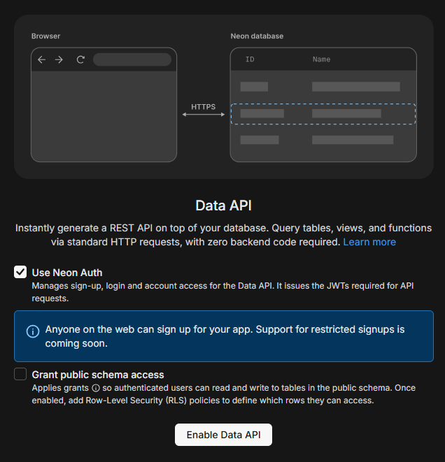
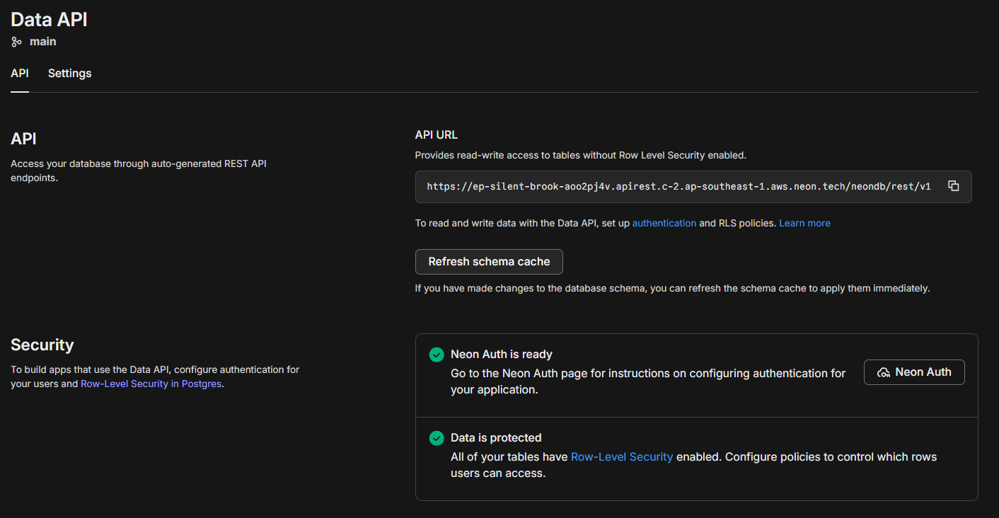
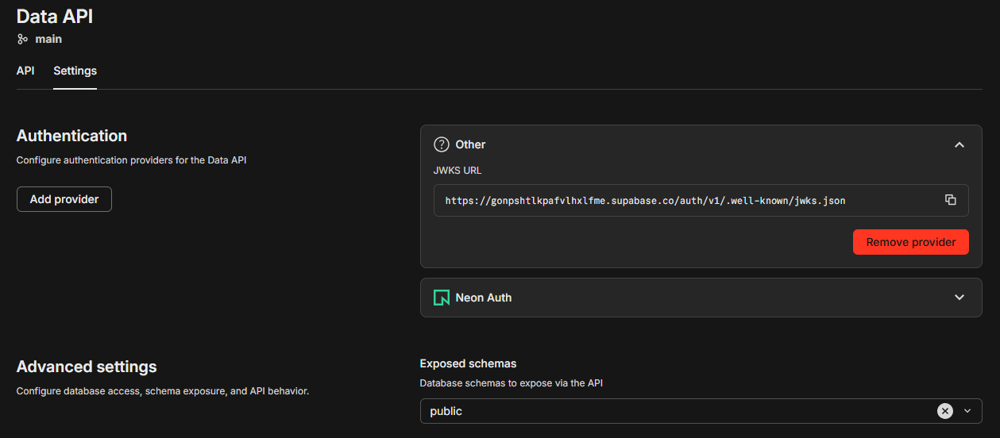
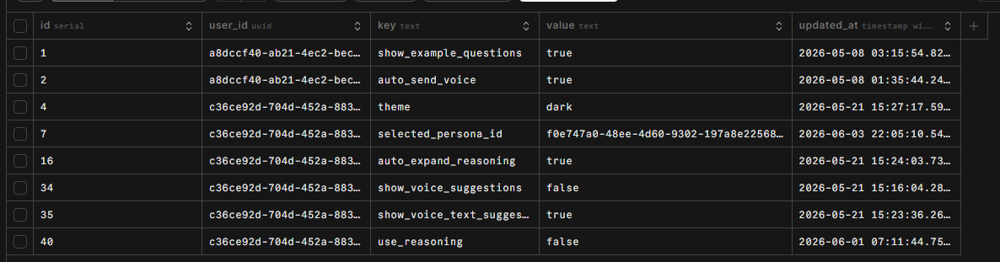

# Dịch vụ cài đặt (setting service - dùng neon API)

Mục đích: dùng neon API cơ sở dữ liệu postgres để người dùng có thể GET và POST (khóa, giá trị) cài đặt một số thông tin.

Trong giao diện web của Neon
thực hiện kích hoạt thủ công Data API

Trong giao diện web của Neon có thông tin URL của REST API

Neon có hỗ trợ cấu hình thông tin xác thực của supabase

Dùng SQL để tạo bảng settings: id, user_id, key, value, updated_at

Kích hoạt bảo mật RLS: Chỉ chủ sở hữu mới có quyền thay đổi dữ liệu cài đặt của họ

## Cấu hình trong Kong API Gateway

Tạo Service trong Kong để trỏ trực tiếp đến endpoint REST API của bảng settings trên Neon.

Thay vì tạo một Route chung cho tất cả các request, hệ thống được cấu hình để phân loại luồng đọc (GET) và luồng ghi (POST). Tham số strip_path=true giúp Kong loại bỏ tiền tố URI trước khi gửi đến Neon.

Cấu hình Plugin xử lý Upsert tự động:
Trong REST API dựa trên postgres, để thực hiện hành động Upsert, client phải gửi kèm các tham số cụ thể trên URL (querystring=on_conflict:user_id, key) và Header (Prefer:resolution=merge-duplicates).
Dùng plugin request-transformer để Kong API Gateway tự động gắn các tham số phức tạp này.
