# Dịch vụ thanh toán (payment service)

Sơ đồ tổng quan về Dịch vụ thanh toán (payment service)

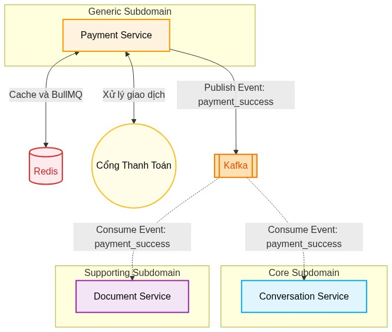

Mục đích:
Dịch vụ thanh toán (payment service)
dùng để quản lý thông tin
gói dịch vụ (plans), quản lý thuê bao người dùng (subscriptions)
và tích hợp xử lý thanh toán.

Quản lý Gói dịch vụ

Cho phép hệ thống định nghĩa và cung cấp các dịch vụ tới người dùng.

Tạo mới gói dịch vụ: Quản trị viên có thể thiết lập cấu hình cho một gói dịch vụ mới bao gồm các thông số: tên gói (VD: VIP 1 tháng), thời hạn sử dụng, giá tiền (VND), trạng thái hoạt động và các tính năng đi kèm (VD: Sử dụng suy luận, voice, xử lý tài liệu).

Truy xuất danh sách gói: Lấy danh sách toàn bộ các gói dịch vụ hiện có trên hệ thống để hiển thị cho người dùng. Chức năng này được tối ưu hiệu năng bằng cơ chế phân trang thông qua tham số skip và limit .

Lưu thông tin cache các danh sách plan vào Redis.

Khi người dùng yêu cầu danh sách các gói đăng ký, hệ thống sẽ ưu tiên đọc từ Redis.
Nếu cache trống, hệ thống truy xuất cơ sở dữ liệu, trả về kết quả và lưu lại vào Redis.

Lưu trữ gói (Vô hiệu hóa): Cho phép quản trị viên gỡ bỏ hoặc lưu trữ một gói dịch vụ.

Quản lý Thuê bao và Giao dịch

quản lý Thuê bao người dùng và các giao dịch phát sinh:

Mua gói: Người dùng khởi tạo yêu cầu thanh toán cho một gói dịch vụ cụ thể. Hệ thống tiếp nhận mã gói ( plan_id ) và đường dẫn chuyển hướng ( redirect_url ) để đưa người dùng tới cổng thanh toán.

Tích hợp chức năng hủy thanh toán nếu hết thời gian chờ trong Redis.

Gửi sự kiện thanh toán thành công cho kafka.

Gửi email thông báo thanh toán thành công cho người dùng.

Tra cứu thông tin Thuê bao người dùng: Cho phép người dùng xem trạng thái gói dịch vụ hiện tại mà họ đang sở hữu và có quyền sử dụng.

Tra cứu lịch sử giao dịch: Cung cấp danh sách các lần thanh toán trước đó của người dùng, hỗ trợ tính năng phân trang để dễ dàng theo dõi.

Kích hoạt giao dịch thủ công: Một chức năng quản trị cho phép can thiệp trực tiếp để kích hoạt một mã giao dịch ( transaction_id ) thành công, dùng trong các trường hợp xử lý sự cố hoặc hỗ trợ khách hàng ngoại lệ.

Tích hợp Cổng thanh toán

Xử lý Callback (IPN): Cung cấp các endpoint (nhận cả GET và POST ) để cổng thanh toán có thể âm thầm gọi về hệ thống (server-to-server) nhằm cập nhật trạng thái giao dịch một cách chính xác nhất.

Xử lý Return URL: Cung cấp các endpoint (nhận cả GET và POST ) để tiếp nhận và điều hướng giao diện người dùng ngay sau khi họ hoàn tất thao tác trên trang thanh toán của đối tác.

Các API chính trong tài liệu swagger API Dịch vụ thanh toán (payment service)

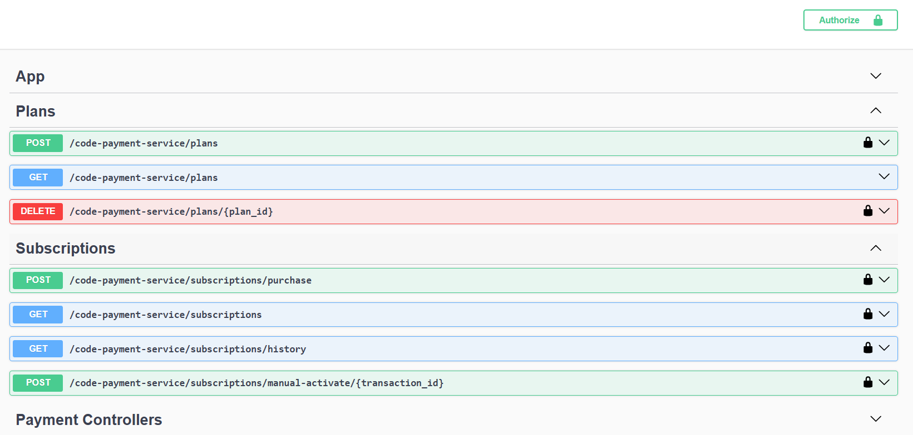

Trong quá trình phát triển đồ án, em tìm kiếm dịch vụ cung cấp sẵn về thanh toán
nhưng không có hỗ trợ các cổng thanh toán Việt Nam
như VNPay, ZaloPay, MoMo, SePay, ...
vì vậy em đã tự phát triển dịch vụ thanh toán này
và triển khai trên Heroku.
Heroku tự đóng gói dịch vụ bằng Docker
và chạy khi đã pass test trong CI/CD github action.
Heroku có hỗ trợ kết nối
với Kafka cũng như Redis để chạy BullMQ.

Triển khai Dịch vụ thanh toán (payment service) độc lập tại heroku

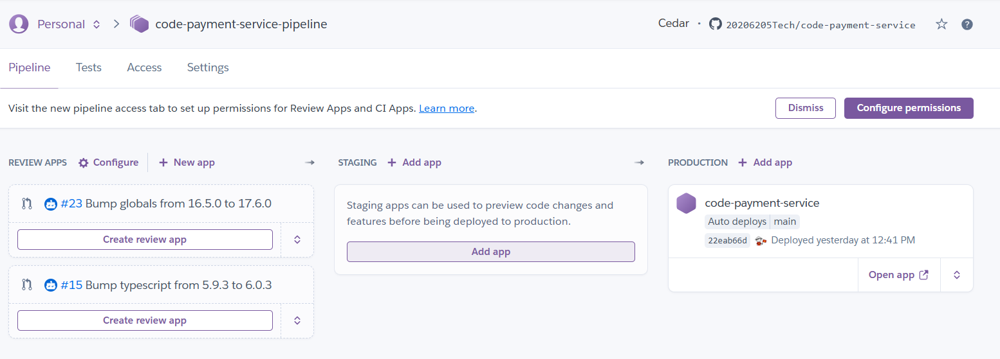

Thông tin kiểm tra tự động của Pull Request trên GitHub

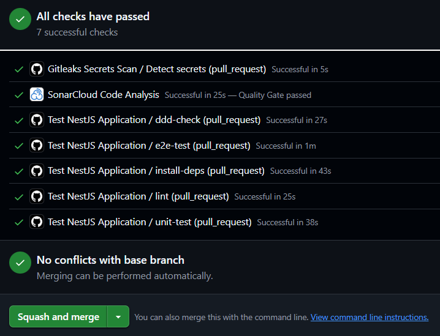

Các bước CI/CD tự động test trên github action

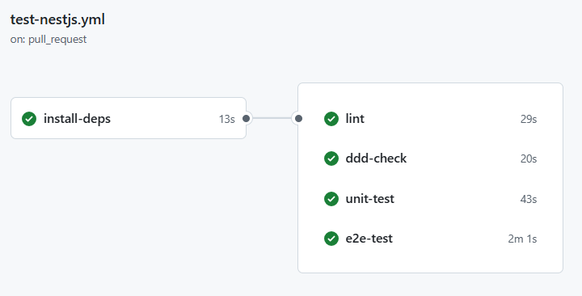

Quản lý các di chuyển cơ sở dữ liệu trong github action

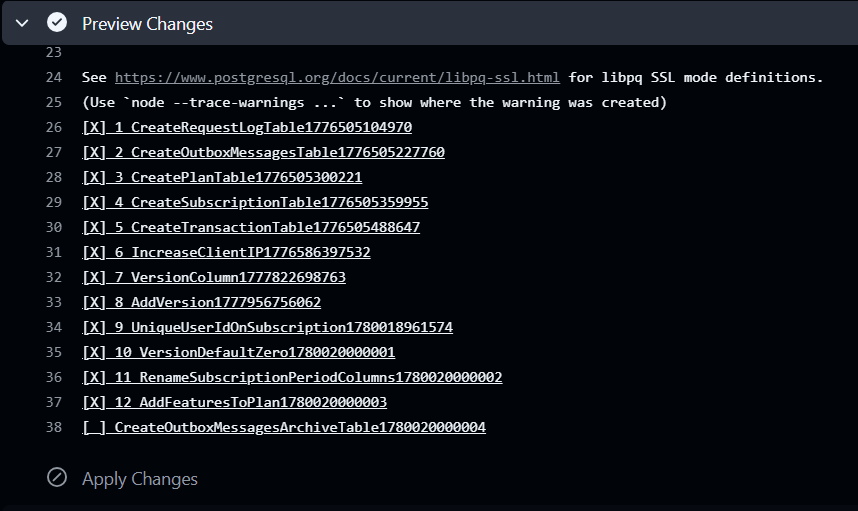

Các bảng có trong cơ sở dữ liệu của Dịch vụ thanh toán (payment service)

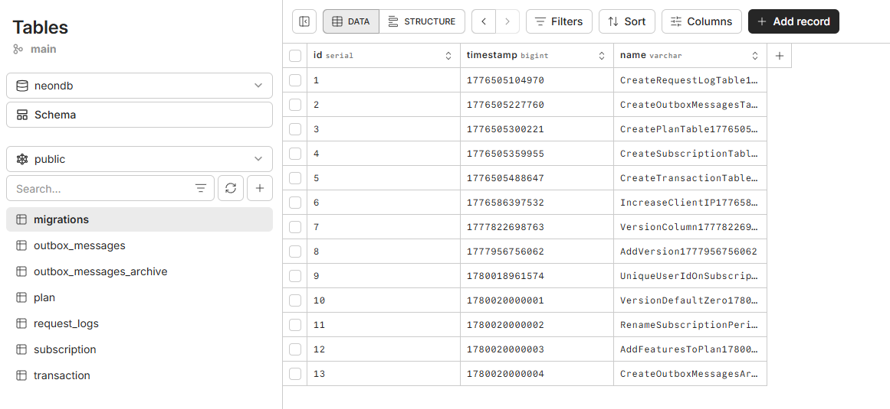

Instant Payment Notification
(IPN)
được sử dụng để
Đơn vị cung cấp dịch vụ thanh toán
Payment Service Provider (PSP)
thông báo kết quả giao dịch
cho đơn vị sử dụng dịch vụ thanh toán
Payment Service Consumer (PSC).

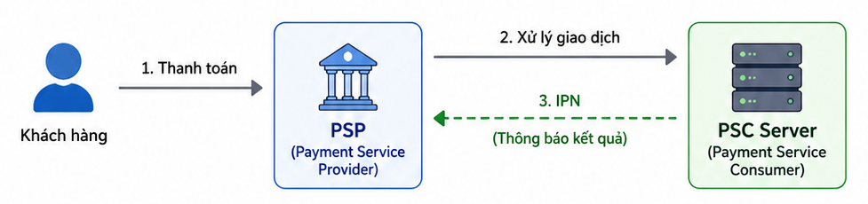

Sau khi khách hàng thanh toán xong, mạng có thể bị rớt
hoặc họ có thể vô tình đóng trình duyệt trước khi được chuyển hướng
về lại trang web     (Return URL).
IPN đảm bảo rằng server
vẫn sẽ nhận được kết quả cuối cùng một cách độc lập để cập nhật trạng thái đơn hàng.

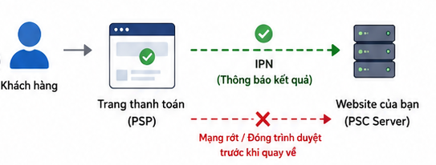

<!-- Xử lý thanh toán trùng lặp.... -->

<!-- * **Idempotency (Tính lũy đẳng):** Đảm bảo webhook của cổng thanh toán gọi lại nhiều lần không làm nhân đôi sự kiện gửi Kafka hoặc Email. -->
<!-- * **Bảo mật Webhook:** Xác thực chữ ký (signature) từ các cổng thanh toán (Stripe, Momo, VNPay...) ở endpoint `/checkout/success` để tránh việc giả mạo gọi API. -->
<!-- * **Redis Keyspace Notifications:** Nếu bạn cần hệ thống *chủ động* hoàn trả (refund) hoặc gọi API đối tác ngay tại thời điểm hết hạn thanh toán (thay vì chờ người dùng gọi lại endpoint), bạn có thể bật tính năng `notify-keyspace-events Ex` trong Redis để một Worker lắng nghe tự động các key hết hạn. -->

<!-- thiết kế clss -->
<!-- Vẽ hình thiết kế  Domain Driven Design  -->

<!-- demo -->

Dự án được thiết kế theo
Domain Driven Design (DDD)
kết hợp kiến trúc Hexagonal Architecture.
Dể demo việc dễ dàng thay đổi hệ thống bên ngoài
hệ thống không có chọn nhiều cách thanh toán mà sẽ được
cài đặt cấu hình cố định một cổng thanh toán qua
biến môi trường PAYMENT_DEFAULT_PROVIDER.
Vì cổng thanh toán phụ thuộc vào interface
nên việc đáp ứng rất dễ dàng thay đổi
nhiều cổng thanh toán khác nhau.

vnpay

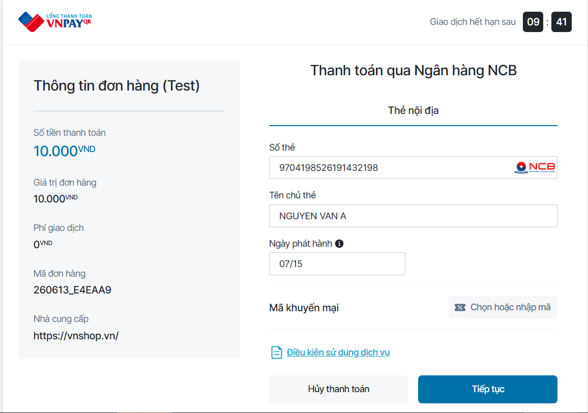

momo

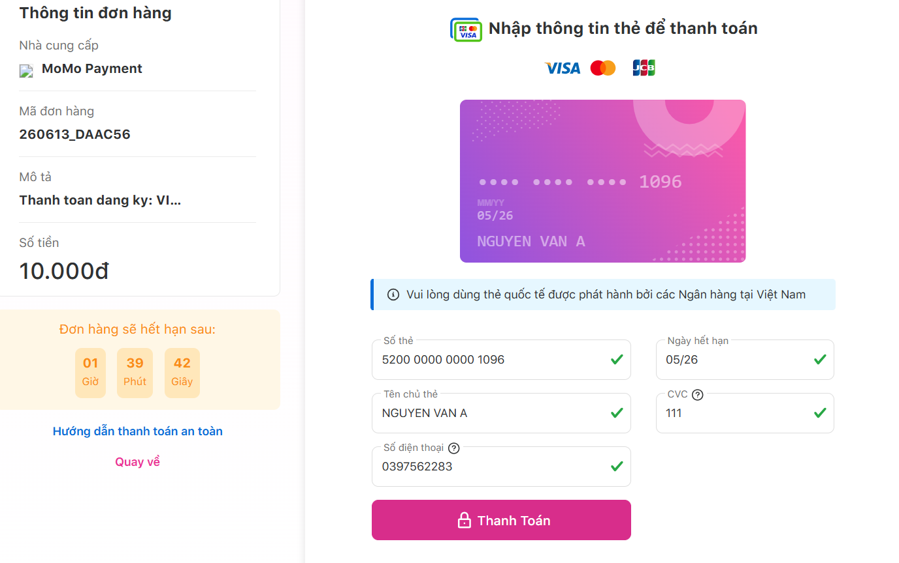

zalo

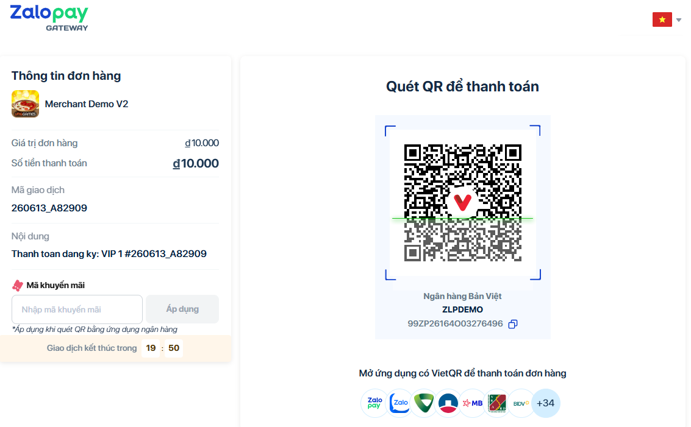

sepay

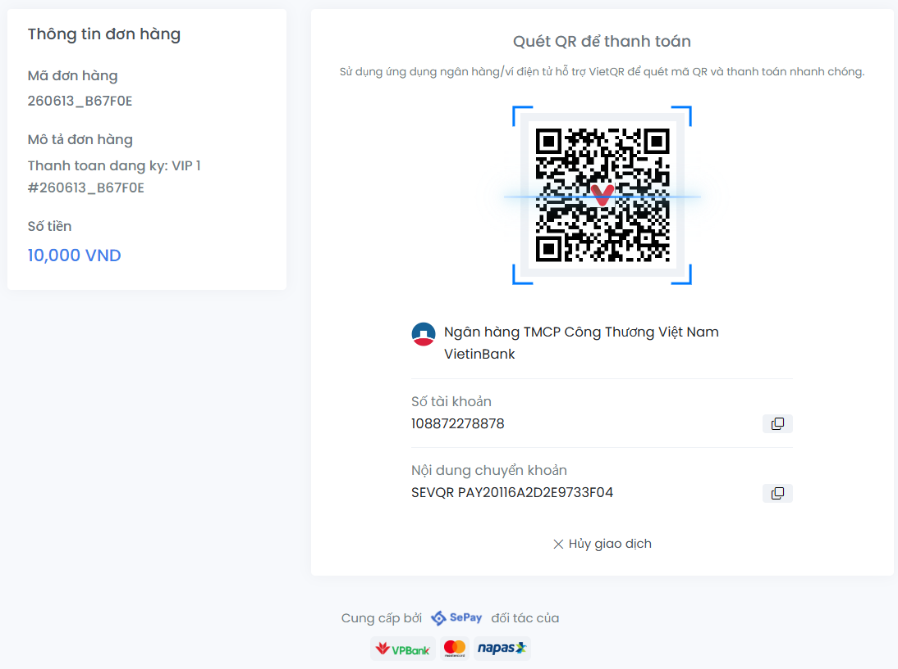

<!-- lý thuyết Đảo ngược phụ thuộc (Dependency Inversion) -->

<!-- 44: Phần người dùng hủy gói, trả lại tiền (Khó) -->
<!-- Mã giảm giá khó chưa làm  -->
<!-- 6: Đang thiếu phần hóa đơn (Để sau) -->

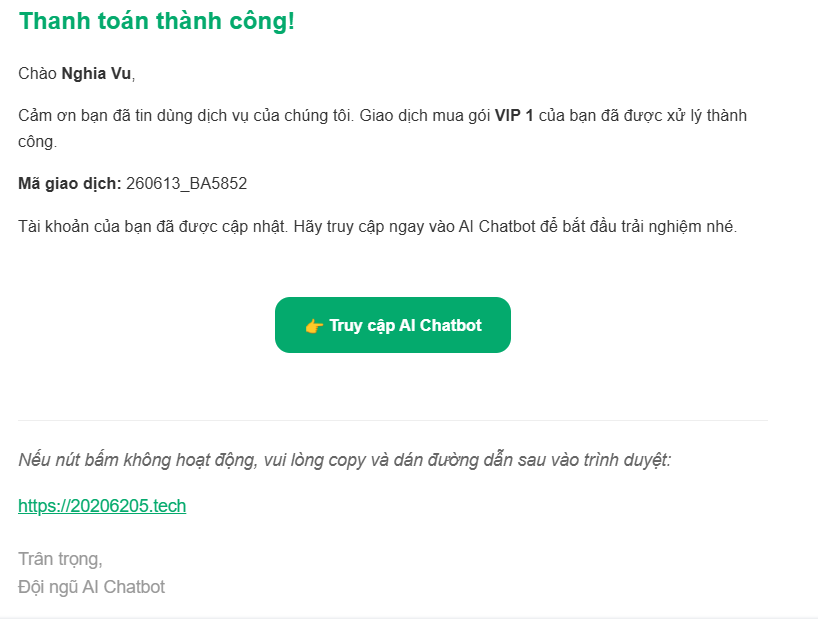
