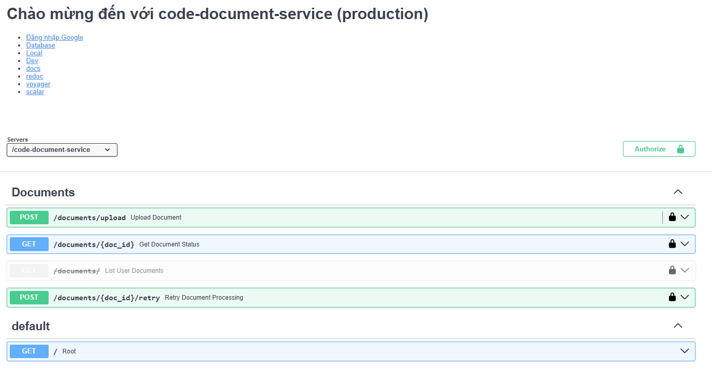
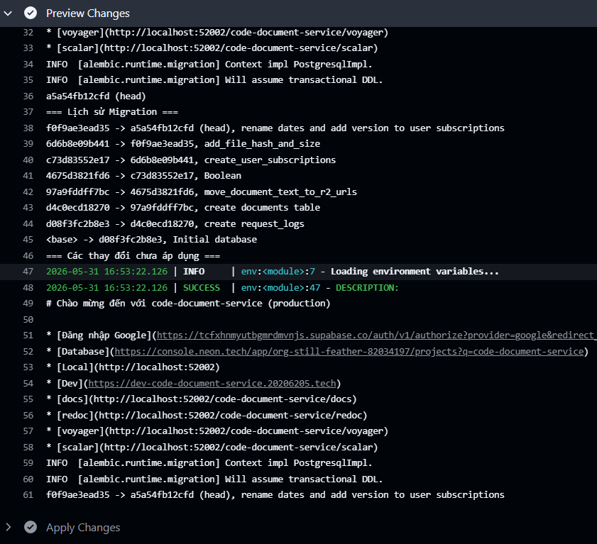
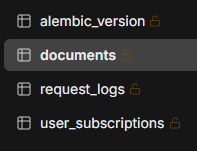

# Dịch vụ văn bản (document service)

x: Nhận thông tin sự kiện thanh toán thành công kafka

Chức năng này chỉ dành cho người dùng VIP
x: Kiểm tra người dùng hiện tại có phải người dùng VIP?

Chỉ cần tải lên file

Dùng cloudflare R2 lưu file người dùng

Dùng docling để trích xuất thông tin file người dùng

Công việc sau đó được xử lý ngầm:

Tóm tắt nội dung file

Vector hóa file với RAG và lưu vào qdrant

<!-- RabbitMQ -->
<!-- Vẽ  Hướng dẫn Mermaid tạo sơ đồ  -->

## Báo Cáo Mô Tả Chức Năng Microservice: Code Document Service

**Tổng quan hệ thống**
`code-document-service` là một vi dịch vụ (microservice) cốt lõi chuyên phụ trách việc tiếp nhận, lưu trữ và quản lý luồng xử lý tài liệu của người dùng. Dịch vụ này không chỉ lưu trữ file gốc mà còn hỗ trợ quy trình trích xuất nội dung (thành định dạng Markdown) và tạo bản tóm tắt. Hệ thống sử dụng cơ sở dữ liệu **PostgreSQL (Neon)** và cung cấp giao diện tài liệu API đa dạng qua Swagger (docs), ReDoc, Voyager, và Scalar.

---

### 1. Quản lý và Tải lên Tài liệu (Document Upload)

Phân hệ này đảm nhận việc tiếp nhận dữ liệu đầu vào từ người dùng:

- **Tải lên tài liệu mới:** Cho phép người dùng gửi file tài liệu lên hệ thống thông qua định dạng `multipart/form-data`. Sau khi tiếp nhận thành công, hệ thống sẽ trả về mã định danh duy nhất (`doc_id`), tên file gốc và trạng thái khởi tạo ban đầu để đưa vào hàng đợi xử lý.

### 2. Trích xuất, Xử lý và Theo dõi Trạng thái (Document Processing & Status)

Đây là tính năng quan trọng nhất, cung cấp cái nhìn toàn cảnh về vòng đời của một tài liệu sau khi tải lên:

- **Tra cứu trạng thái chi tiết:** Dựa vào `doc_id`, người dùng có thể truy xuất trạng thái xử lý hiện tại của tài liệu. Hệ thống sẽ báo cáo chi tiết về sự tồn tại của các thành phần dữ liệu thông qua các cờ trạng thái:
- `has_file`: Xác nhận file gốc đã được lưu trữ an toàn.
- `has_content`: Xác nhận tài liệu đã được bóc tách và chuyển đổi nội dung thành công (thường xuất ra định dạng `.md`).
- `has_summary`: Xác nhận hệ thống đã hoàn tất việc tạo bản tóm tắt nội dung (định dạng `.txt`).

- **Truy cập tài nguyên:** API này đồng thời cung cấp các đường dẫn (URL) trực tiếp để người dùng hoặc các ứng dụng khác có thể tải xuống/truy cập file gốc (`file_url`), file nội dung đã bóc tách (`parsed_content_url`) và file tóm tắt (`summary_url`).
- **Xử lý lại tài liệu (Retry):** Trong trường hợp quá trình bóc tách hoặc tóm tắt gặp sự cố (lỗi timeout, lỗi format, ...), hệ thống cung cấp một API chuyên biệt để kích hoạt lại (retry) quy trình xử lý cho tài liệu đó mà không cần phải upload lại file gốc.

### 3. Truy xuất Danh sách Tài liệu (Document Listing)

- **Lấy danh sách tài liệu cá nhân:** Cung cấp chức năng liệt kê các tài liệu mà người dùng đã tải lên hệ thống, hỗ trợ phân trang với các tham số `skip` và `limit`.
- _Lưu ý:_ Endpoint này hiện đang được đánh dấu là **Deprecated** (lỗi thời/chuẩn bị loại bỏ) trong tài liệu kỹ thuật, báo hiệu khả năng luồng truy vấn danh sách có thể đã được chuyển giao cho một service khác hoặc đang trong quá trình tái cấu trúc API.
