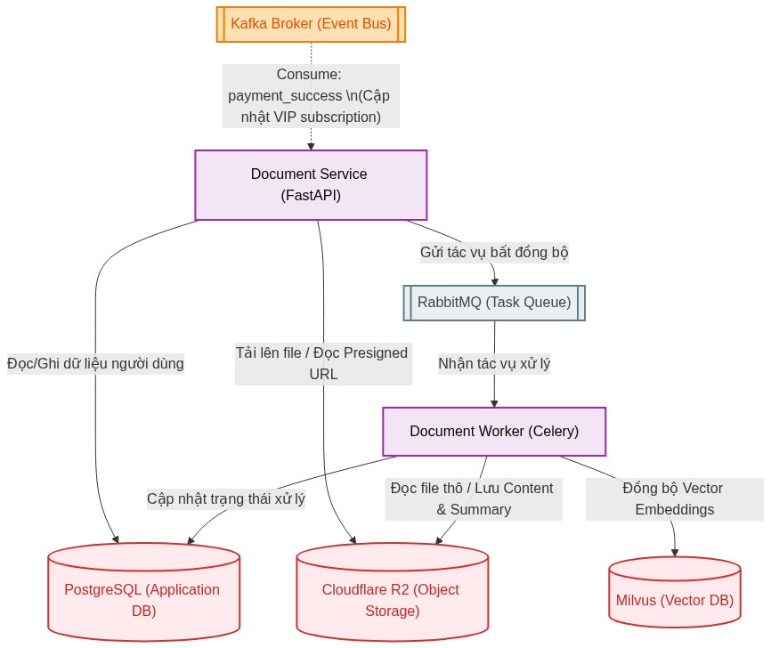
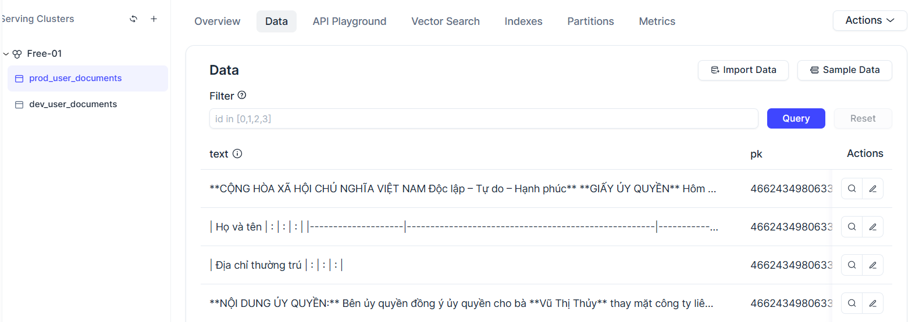
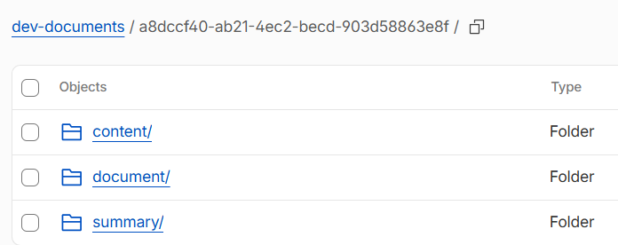
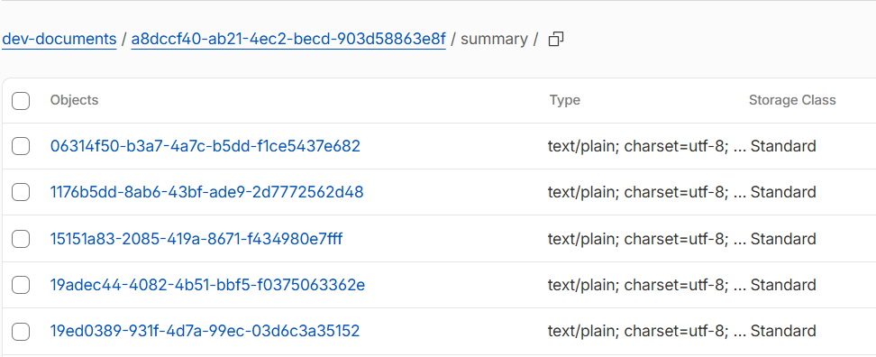
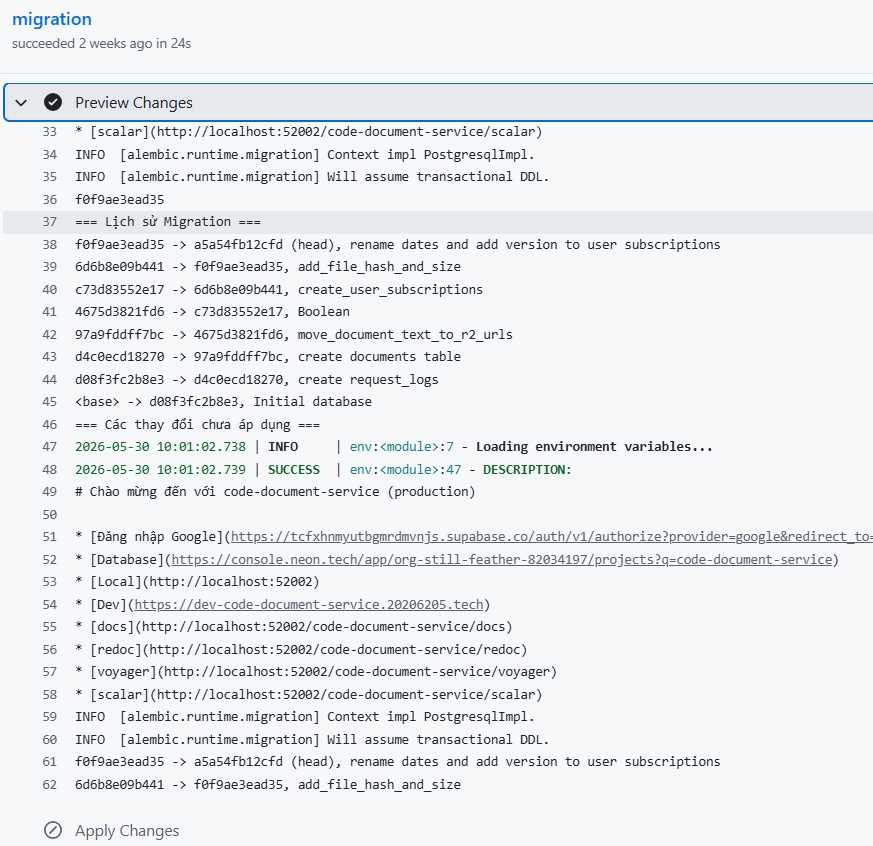
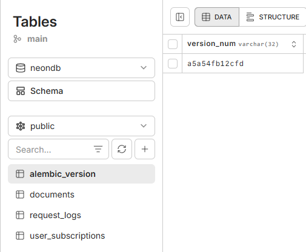

# Dịch vụ văn bản (document service)

Sơ đồ tổng quan về Dịch vụ    văn bản (document service)

Mục đích:
tiếp nhận, lưu trữ và quản lý luồng xử lý tài liệu
của người dùng.
Dịch vụ này không chỉ lưu trữ file
mà còn hỗ trợ quy trình
trích xuất nội dung thành định dạng
Markdown, tạo bản tóm tắt
và vector hóa tài liệu.

Dịch vụ văn bản (document service) sử dụng  docling để trích xuất thông tin file của người dùng.
Vì chức năng tải lên file  tài liệu chỉ dành
cho người dùng có gói VIP, nên dịch vụ  văn bản (document service) cần
lắng nghe sự kiện thanh toán thành công từ kafka
Lưu lại  thông tin trong database   và
Kiểm tra người dùng hiện tại có phải người dùng VIP.

Tải lên tài liệu mới: người dùng gửi file tài liệu lên hệ thống. Sau khi tiếp nhận thành công, hệ thống sẽ trả về mã định danh duy nhất (doc_id), tên file gốc và trạng thái khởi tạo ban đầu để đưa vào hàng đợi xử lý.

Dựa vào doc_id, người dùng có thể truy xuất trạng thái xử lý hiện tại của tài liệu.
Hệ thống sẽ báo cáo chi tiết về sự tồn tại của các thành phần dữ liệu thông qua các cờ trạng thái:
has_file, has_content, has_summary.

Trong trường hợp quá trình bóc tách hoặc tóm tắt gặp sự cố, hệ thống cung cấp một API chuyên biệt để kích hoạt lại quy trình xử lý cho tài liệu đó mà không cần phải upload lại file gốc.

<!-- Nếu từ cùng 1 người dùng tải lên 1 file => sao chép quá trình -->

Dịch vụ văn bản (document service)
có document worker
nhận công việc từ Celery
thông qua
RabbitMQ
thực hiện
  hệ thống RAG
xử lý tài liệu:

Kéo file từ Cloudflare R2 và sử dụng docling để bóc tách văn bản.

Sử dụng mô hình Cloudflare Workers AI  để tạo bản tóm tắt tiếng Việt.

Chia nhỏ  (Chunking): Sử dụng RecursiveCharacterTextSplitter của LangChain

Nhúng (Embedding): Tạo vector bằng mô hình keepitreal/vietnamese-sbert.

Lưu trữ Vector:  Quản lý và lưu trữ các embedding vào Milvus để phục vụ truy xuất sau này.

