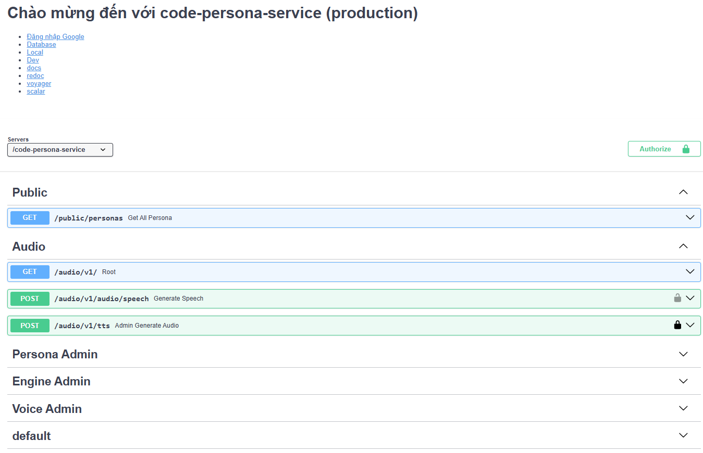
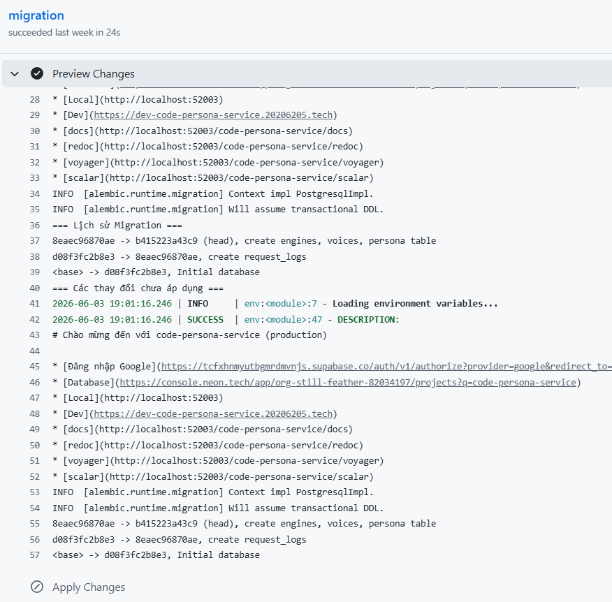
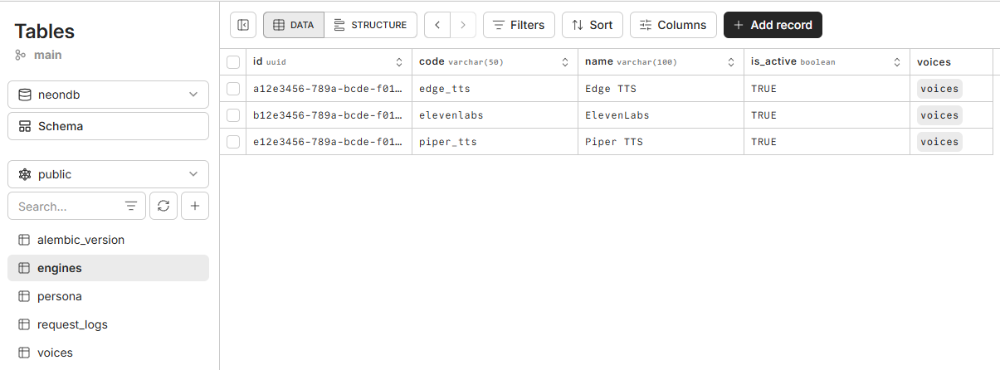
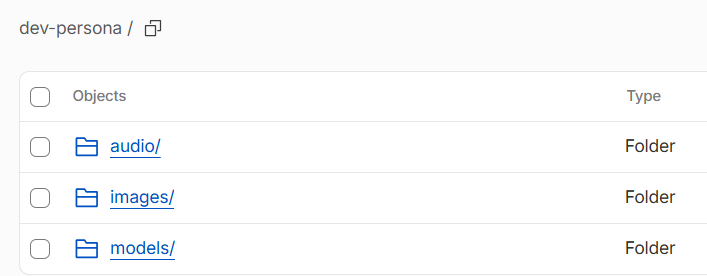

# Dịch vụ nhân vật (persona service)

Mục đích:
chịu trách nhiệm quản lý hệ thống nhân vật, kho giọng đọc (Voices), các nền tảng tổng hợp giọng nói (TTS Engines) và xử lý trực tiếp các yêu cầu chuyển đổi văn bản thành âm thanh (Text-to-Speech).

<!-- Quản lý Nhân vật ảo -->

Truy xuất danh sách      nhân vật:           Cung cấp danh sách các nhân vật, hỗ trợ phân trang
Xem chi tiết      nhân vật:           Lấy thông tin cụ thể của một nhân vật dựa trên định danh (`persona_id`), bao gồm tên, giới tính, mô tả, ảnh đại diện, và câu chào mẫu.

- **Dành cho Quản trị viên (     nhân vật     Admin):**
- **Quản lý vòng đời      nhân vật:           Khởi tạo mới, cập nhật thông tin hoặc xóa bỏ các nhân vật ảo khỏi hệ thống.
- **Quản lý Tài nguyên Truyền thông:** Cung cấp các API chuyên biệt để tải lên ảnh đại diện (`upload-avatar`) và tệp âm thanh câu chào mẫu (`upload-audio`) cho từng      nhân vật    .

### 2. Quản lý Giọng đọc và Nền tảng (Voices & Engines)

- **Quản lý Nền tảng (Engine Admin):** Cho phép admin định nghĩa, cập nhật, xóa và lấy danh sách các nền tảng/dịch vụ cung cấp TTS. Mỗi engine sẽ có mã (`code`), tên (`name`) và trạng thái hoạt động.
- **Quản lý Giọng đọc (Voice Admin):**
- Khởi tạo, cập nhật, xóa và truy xuất danh sách các giọng đọc cụ thể, cho phép lọc theo mã nền tảng (`engine_code`). Mỗi giọng đọc sẽ được liên kết trực tiếp với một Engine ID.
- **Đồng bộ hóa ElevenLabs:** Tích hợp tính năng tự động đồng bộ (`sync-elevenlabs`) để cập nhật danh sách giọng đọc mới nhất trực tiếp từ nhà cung cấp ElevenLabs về hệ thống cơ sở dữ liệu.

### 3. Dịch vụ Xử lý Âm thanh (Audio / Text-to-Speech)

Cung cấp khả năng tạo ra tệp âm thanh từ văn bản đầu vào:

- **Tạo giọng nói API (Generate Speech):** Cho phép các hệ thống/ứng dụng khác gọi API để tạo tệp âm thanh (hỗ trợ các định dạng như mp3, wav, ogg) hoặc truyền phát (stream). API này cho phép tùy chỉnh văn bản, model, mã giọng đọc và tốc độ đọc.
- **Công cụ Kiểm thử cho Admin (Admin Generate Audio):** API dành riêng cho quản trị viên để nhập văn bản và tạo âm thanh. Cung cấp tham số `is_download` cho phép quản trị viên lựa chọn nghe thử trực tiếp trên trình duyệt hoặc tải file âm thanh về máy.

