# Dịch vụ trò chuyện (conversation service) và Dịch vụ chatbot (chatbot service)

Sơ đồ tổng quan về Dịch vụ trò chuyện (conversation service) và Dịch vụ chatbot (chatbot service)

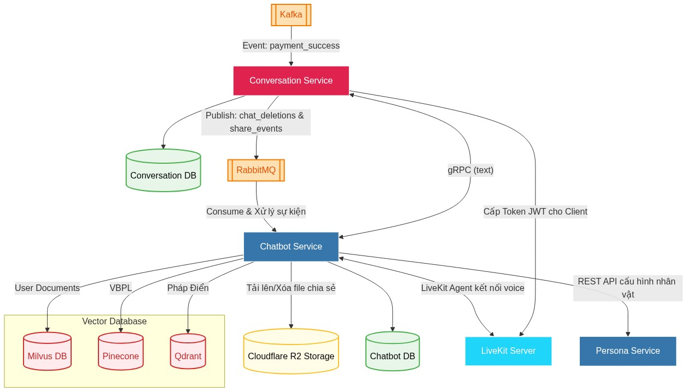

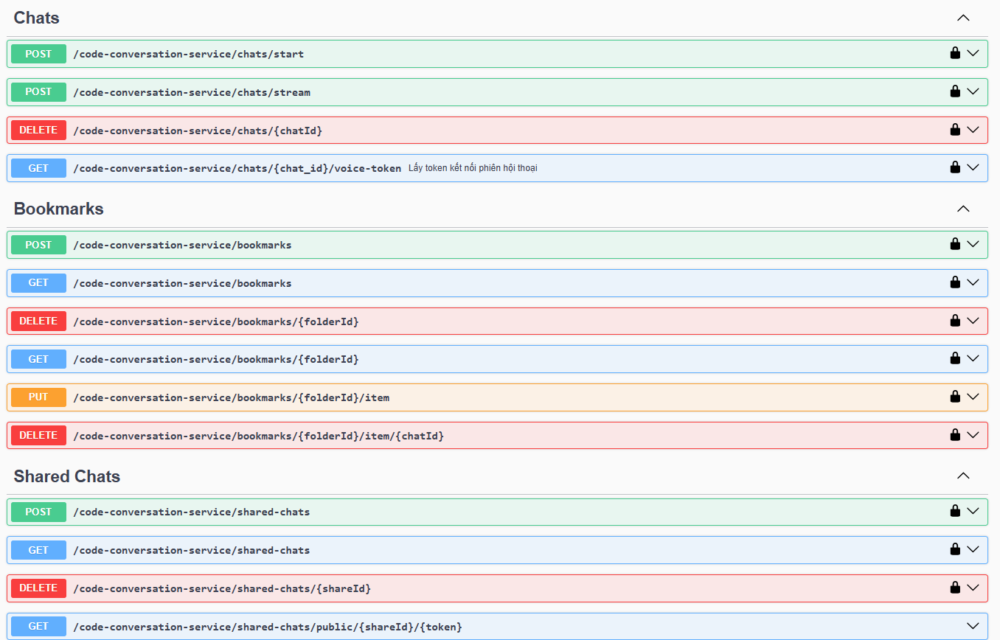

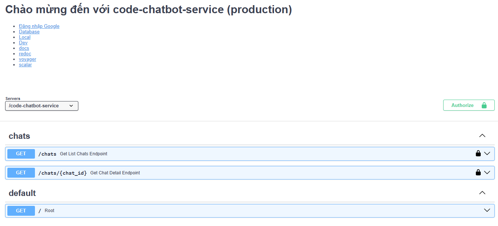

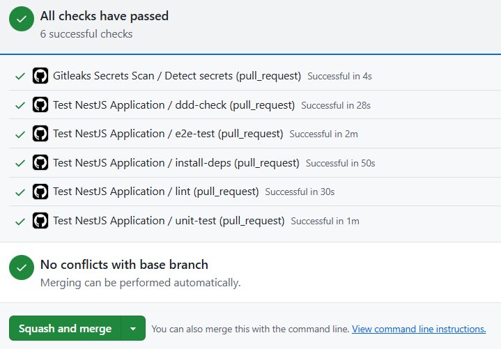
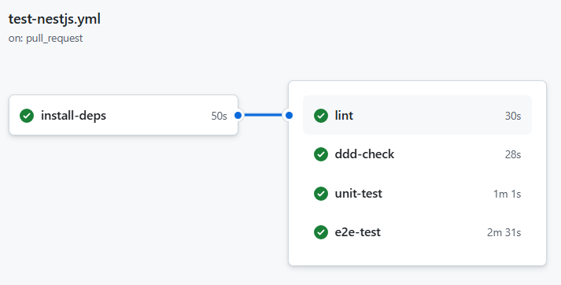

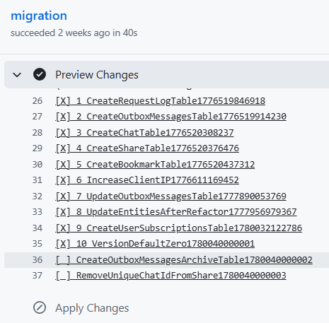
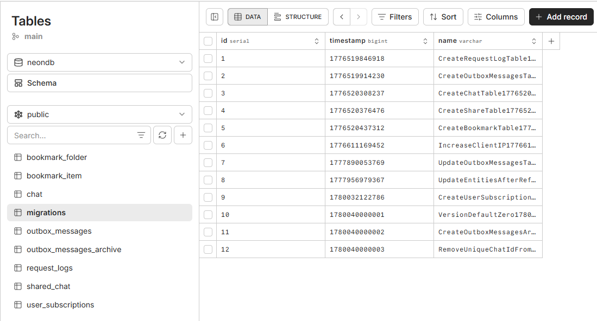

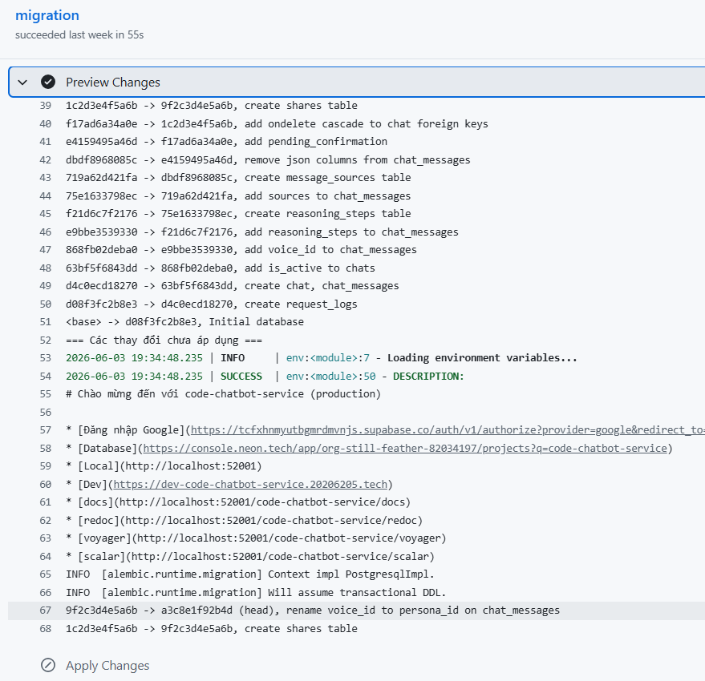
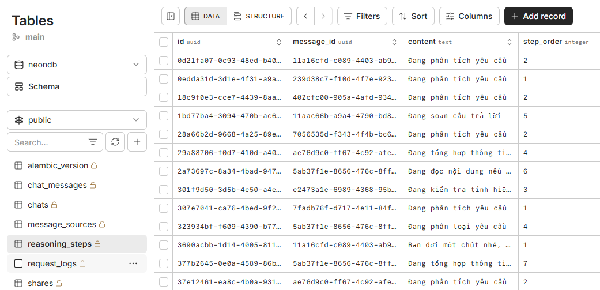

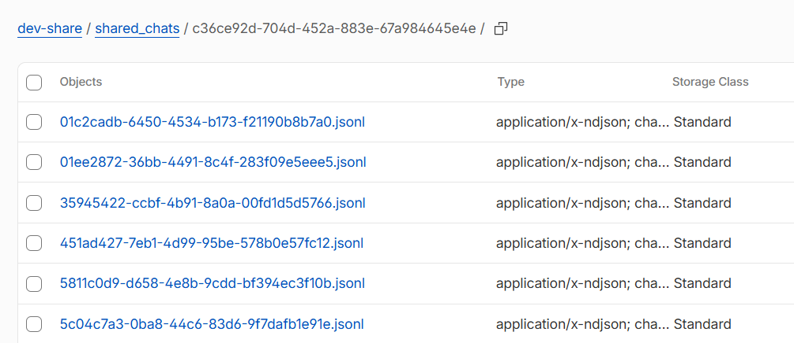

<!-- Chưa cần vì hết chức năng -->
<!-- x: Nhận thông tin sự kiện thanh toán thành công kafka -->
<!-- x: Nhận thông tin sự kiện thanh toán thành công kafka -->
<!-- x: Kiểm tra người dùng hiện tại có phải người dùng VIP? -->

Nhận POST chat id, text, và file (VIP) gửi vào ai python agentic bằng gRPC

Chức năng xóa DELETE chat bằng RabbitMQ

Chỉ lưu thông tin chat id khi nhận request của frontend

Quản lý việc lưu lại bookmark

Quản lý việc chia sẻ share

Kết quả API swagger của dịch vụ

Mô tả chi tiết các chức năng

Cấu hình trong Kong API Gateway

Thông tin các bảng được lưu trong cơ sở dữ liệu

Thông tin di chuyển cơ sở dữ liệu

Thông tin github action

Xử lý chia sẻ Chat

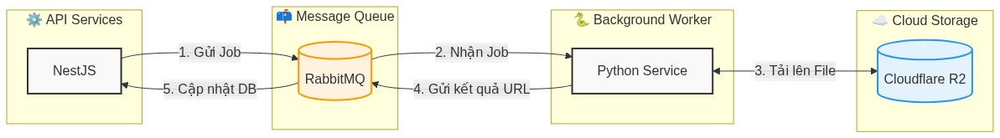

Đây là phần quan trọng nhất của hệ thống, sử dụng langgraph tạo agentic ai phức tạp.

Chat => lưu cơ sở dữ liệu
Get ra
Xóa theo sự kiện của RabbitMQ

Thêm xử lý file cho người dùng VIP

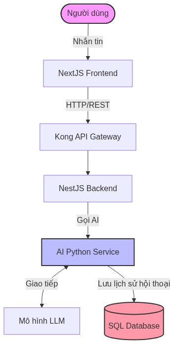

## Báo Cáo Mô Tả Chức Năng Microservice: Code Conversation Service

**Tổng quan hệ thống**
`code-conversation-service` là vi dịch vụ (microservice) trung tâm chịu trách nhiệm quản lý toàn bộ luồng giao tiếp giữa người dùng và hệ thống Agentic RAG. Dịch vụ này xử lý trực tiếp các phiên trò chuyện văn bản theo cơ chế streaming, cấp phát quyền truy cập cho luồng giao tiếp giọng nói (Voice), và cung cấp các tiện ích lưu trữ, chia sẻ trò chuyện. Hệ thống lưu trữ dữ liệu trên **PostgreSQL (Neon)** và yêu cầu xác thực bảo mật khắt khe.

---

### 1. Quản lý Phiên trò chuyện cốt lõi (Chats)

Phân hệ này đảm nhận việc giao tiếp trực tiếp với các mô hình ngôn ngữ lớn (LLMs), tích hợp tra cứu tài liệu và xử lý suy luận sâu:

- **Khởi tạo và Xóa phiên:** Cho phép bắt đầu một luồng trò chuyện mới hoặc xóa bỏ hoàn toàn một phiên chat (`chatId`) khỏi hệ thống.
- **Xử lý tin nhắn trực tiếp (Stream Chat):** Đây là API xương sống của hệ thống RAG. Giao thức này cho phép gửi luồng dữ liệu theo thời gian thực (streaming) để giảm độ trễ. Payload hỗ trợ đa dạng cấu hình:
- Nhận truy vấn văn bản từ người dùng (VD: _"Quy định về giảm trừ gia cảnh thuế TNCN 2026 là gì?"_).
- Gắn kèm các định danh tài liệu (`file_ids`) để mô hình tham chiếu.
- Kích hoạt cờ `use_reasoning` để yêu cầu mô hình sử dụng chuỗi suy luận phức tạp trước khi trả lời.

- **Cấp phát Token Hội thoại Giọng nói (Voice Token):** API chuyên biệt dành cho người dùng gói VIP để kết nối vào phòng trò chuyện thời gian thực. Hệ thống sẽ trả về Access Token dựa trên định danh nhân vật ảo (`persona_id`) và chế độ suy luận, tạo tiền đề để tích hợp các luồng giao tiếp âm thanh hai chiều không độ trễ.

### 2. Quản lý Dấu trang và Ghi chú (Bookmarks)

Để hỗ trợ người dùng tổ chức và lưu trữ kiến thức dài hạn, dịch vụ cung cấp hệ thống thư mục dấu trang cá nhân hóa:

- **Quản lý Thư mục:** Người dùng có thể tạo các thư mục lưu trữ với tên gọi tùy chỉnh (VD: "Web dev series", "Tra cứu luật pháp"), xem danh sách thư mục (có phân trang) và xóa thư mục khi không còn nhu cầu.
- **Đánh dấu và Ghi chú nội dung:** Cho phép lưu lại một đoạn trò chuyện cụ thể (`chatId`) vào thư mục tương ứng. Đặc biệt, hệ thống hỗ trợ người dùng đính kèm các ghi chú cá nhân (`note`) cho mỗi mục được lưu (VD: _"Nhớ xem lại mục này!"_), giúp việc tra cứu lại sau này dễ dàng và có ngữ cảnh hơn.

### 3. Chia sẻ Cuộc trò chuyện (Shared Chats)

Cung cấp cơ chế phân phối nội dung an toàn ra bên ngoài hệ thống:

- **Tạo liên kết chia sẻ:** Tạo ra một "bản snapshot" (ảnh chụp nhanh) của cuộc trò chuyện tính đến một tin nhắn cụ thể (`last_message_id`). Hệ thống sẽ sinh ra một liên kết an toàn để người khác có thể đọc nội dung này.
- **Truy cập công khai an toàn:** Cung cấp endpoint public (`/shared-chats/public/...`) cho phép bất kỳ ai có URL (chứa `shareId` và `token` xác thực) đều có thể xem được nội dung cuộc trò chuyện mà không cần đăng nhập, nhưng không có quyền chỉnh sửa.
- **Quản lý phiên chia sẻ:** Chủ sở hữu đoạn chat có thể xem danh sách các liên kết đã tạo (hỗ trợ phân trang) và chủ động thu hồi quyền truy cập (Revoke Share) bất cứ lúc nào bằng cách xóa `shareId`.

### 4. Cơ chế Bảo mật và Xác thực

Vi dịch vụ này áp dụng tiêu chuẩn bảo mật mức độ cao để bảo vệ dữ liệu trò chuyện riêng tư của người dùng:

- **Xác thực Đa yếu tố (MFA):** Ngoại trừ các API xem nội dung chia sẻ công khai và API kiểm tra trạng thái gốc, **toàn bộ** các thao tác như nhắn tin, tạo bookmark, hay sinh link chia sẻ đều bắt buộc tài khoản người dùng phải được bảo vệ bởi xác thực đa yếu tố (`403 Forbidden - Requires Multi-factor authentication`).
- **Định danh JWT:** Sử dụng cơ chế Token Bearer (JWT) thông qua nhà cung cấp Supabase, đồng bộ hóa chặt chẽ với luồng đăng nhập Google của hệ thống.

## Báo Cáo Mô Tả Chức Năng Microservice: Code Chatbot Service

**Tổng quan hệ thống**
`code-chatbot-service` là một vi dịch vụ đóng vai trò là "Read Model" (mô hình đọc) chuyên trách việc truy xuất và hiển thị lịch sử các phiên trò chuyện của hệ thống Agentic RAG. Khác với `code-conversation-service` chịu trách nhiệm xử lý luồng stream (Write/Action), dịch vụ này tập trung vào việc bóc tách và cung cấp dữ liệu trò chuyện chi tiết với các siêu dữ liệu (metadata) phức tạp như chuỗi suy luận và nguồn trích dẫn. Dịch vụ sử dụng cơ sở dữ liệu **PostgreSQL (Neon)** và triển khai bảo mật qua Kong API Gateway.

---

### 1. Truy xuất Danh sách Tổng quan Hội thoại (Chat List)

Phân hệ này cung cấp cái nhìn tổng thể về lịch sử tương tác của người dùng:

- **Lấy danh sách các phiên Chat (`GET /chats`):** Trả về danh sách tóm tắt các cuộc trò chuyện đã diễn ra. Dữ liệu đầu ra (thông qua `ChatSummaryDTO`) được tối giản hóa để tối ưu hiệu năng mạng, chỉ bao gồm mã định danh (`id`), tiêu đề cuộc trò chuyện (`title`) và thời gian cập nhật gần nhất (`updated_at`). API này hỗ trợ phân trang chuẩn qua tham số `skip` và `limit` để hiển thị trên giao diện người dùng.

### 2. Khai thác Chi tiết Tin nhắn và Ngữ cảnh RAG (Chat Details)

Đây là phân hệ cốt lõi thể hiện rõ kiến trúc của một hệ thống AI nâng cao. Khi truy vấn chi tiết một phiên chat (`GET /chats/{chat_id}`), hệ thống không chỉ trả về văn bản thuần túy mà cung cấp một cấu trúc dữ liệu (`ChatMessageDTO`) đa chiều:

- **Định danh Thành phần:** Xác định rõ vai trò của người gửi (`role`), liên kết với nhân vật ảo đang đảm nhận câu trả lời (`persona_id`) và nội dung chính của tin nhắn (`content`).
- **Truy vết Chuỗi suy luận (Reasoning Steps):** Dịch vụ lưu trữ và trả về quá trình "tư duy" của mô hình AI thông qua mảng `reasoning_steps`. Người dùng (hoặc giao diện) có thể xem chi tiết từng bước suy luận theo thứ tự (`step_order`), giúp giải thích cách AI đi đến câu trả lời cuối cùng.
- **Minh bạch Nguồn trích dẫn (Sources/Citations):** Hỗ trợ đắc lực cho kiến trúc RAG, hệ thống trả về danh sách các tài liệu được AI tham chiếu. Cấu trúc `SourceDTO` cung cấp:
- Đường dẫn/tên tài liệu nguồn (`source`) và ID của phân đoạn tài liệu (`item_id`).
- Điểm số mức độ liên quan (`score`) và phương pháp truy xuất (`retrieval_type`).
- **Đặc biệt:** Cờ trạng thái pháp lý (`legal_status`), một trường dữ liệu cực kỳ quan trọng cho phép ứng dụng frontend hiển thị cảnh báo (ví dụ: tài liệu nguồn là văn bản luật "còn hiệu lực" hay "hết hiệu lực").

- **Trạng thái Chờ xác nhận:** Tích hợp cờ `pending_confirmation`, cho phép hệ thống quản lý các luồng trò chuyện yêu cầu người dùng (hoặc admin) phải duyệt trước khi thực thi hành động tiếp theo.
